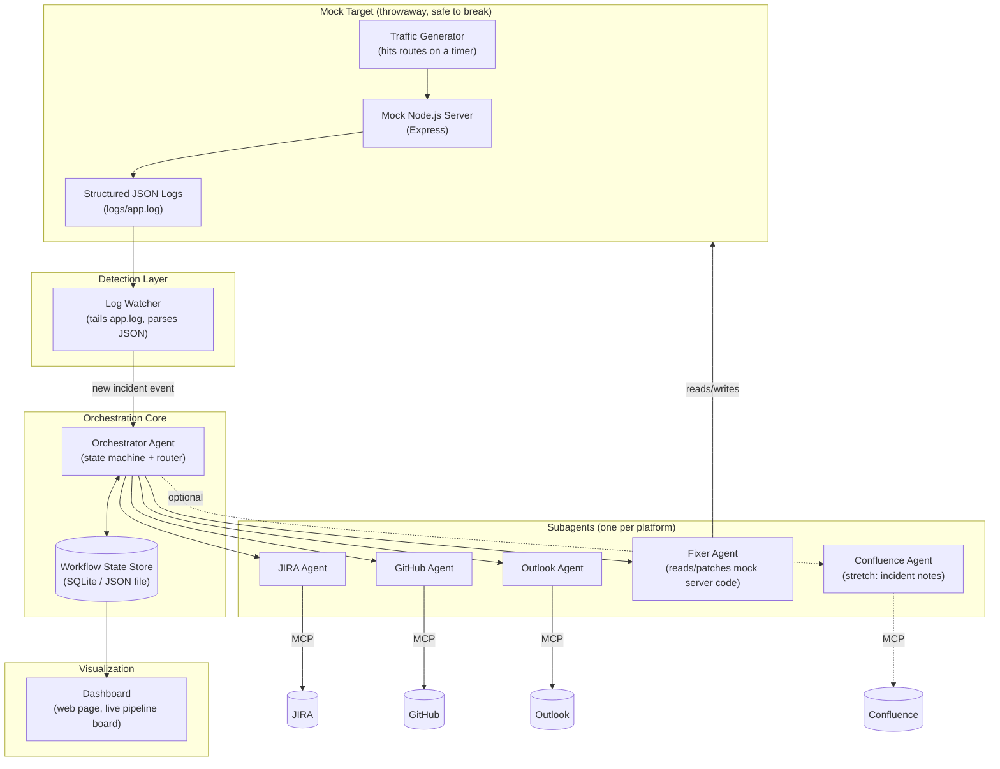
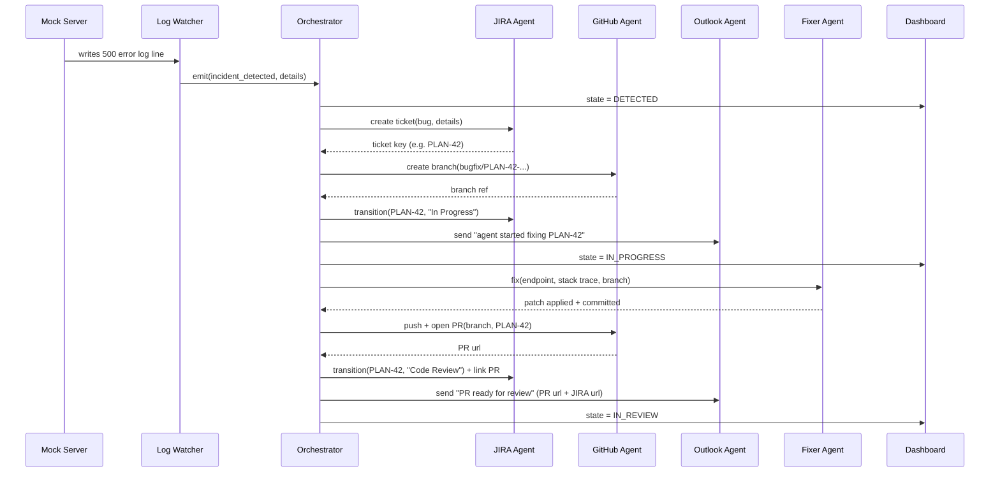

# PlanApp — AI SDLC Orchestrator (Hackathon Edition)

A self-contained simulation of a full software development lifecycle (SDLC), driven end-to-end by an AI orchestrator and its subagents. Built for a one-day hackathon using a company-provided AI SDLC agent with MCP access to JIRA, Confluence, Outlook, and GitHub.

---

## 1. Overview

**The pitch:** a mock Node.js server intentionally produces both healthy (`2xx`) and broken (`4xx`/`5xx`) traffic. An orchestrator agent watches the server's logs, and the moment it spots a failure, it kicks off a full, autonomous dev lifecycle — file a JIRA ticket, branch the repo, notify the team, fix the bug, open a PR, move the ticket to review, notify again — all performed by coordinated subagents talking to real tools (JIRA, GitHub, Outlook) via MCP.

**Why a mock server:** the hackathon rules don't allow modifying a real project. Building a disposable Node.js app gives full control over when/how errors happen, so the demo is reliable and repeatable on stage.

**Core theme:** one **Orchestrator** + many **Subagents**, each responsible for exactly one platform/skill, coordinated through a shared **workflow state**.

---

## 2. Constraints & Available Tools

| Constraint | Detail |
|---|---|
| No editing real projects | Must build an isolated mock target (own throwaway Node.js server + repo) |
| Time | One day — must be demoable, not production-grade |
| Available MCPs | JIRA, Confluence, GitHub, Outlook (via the company AI SDLC agent) |
| Available capabilities | Skills + subagent orchestration from the company agent platform |
| Nice-to-have | A visual dashboard showing the pipeline live |

---

## 3. End-to-End Story (Plain Language)

1. Mock server is running and serving traffic (simulated via a small traffic generator hitting its own endpoints).
2. One request hits a route that's intentionally broken → server logs a structured `5xx`/`4xx` error entry.
3. The **Log Watcher** notices the new error line.
4. The **Orchestrator** wakes up, classifies the error, and starts a new **Incident Workflow**.
5. **JIRA Agent** creates a Bug ticket (title, description, stack trace, endpoint) in the chosen project.
6. **GitHub Agent** creates a branch named after the ticket, e.g. `bugfix/PLAN-42-null-pointer-on-checkout`.
7. **JIRA Agent** transitions the ticket to `In Progress`.
8. **Email Agent** (Outlook) sends "🔧 Agent started working on PLAN-42" with the JIRA link.
9. **Fixer Agent** inspects the failing route/handler in the mock server, generates a patch, applies it on the branch, commits, and pushes.
10. **GitHub Agent** opens a Pull Request referencing the JIRA ticket.
11. **JIRA Agent** transitions the ticket to `Code Review` and links the PR.
12. **Email Agent** sends "✅ PR ready for review" with both the PR URL and the JIRA URL.
13. **Dashboard** reflects every step above in near real time, as it happens.

---

## 4. Architecture

### 4.1 Component Diagram



### 4.2 Sequence Diagram (one incident, happy path)



### 4.3 Component Responsibilities

| Component | Responsibility | Depends on |
|---|---|---|
| Mock Node.js Server | Serves a handful of routes; some always succeed, some fail on purpose; emits structured logs | — |
| Traffic Generator | Periodically calls the mock server's routes so failures happen without manual clicking | Mock Server |
| Log Watcher | Tails the log file, parses each line, detects `status >= 400`, de-dupes repeats, emits an "incident" event | Mock Server logs |
| Orchestrator | Owns the workflow state machine; decides what happens next and calls the right subagent in order; handles retries/failures | Workflow State Store |
| Workflow State Store | Single source of truth for "what stage is ticket X in"; feeds the dashboard | — |
| JIRA Agent | Create ticket, transition status, add comments/links | JIRA MCP |
| GitHub Agent | Create branch, commit, push, open PR | GitHub MCP |
| Outlook Agent | Send status emails at defined checkpoints | Outlook MCP |
| Fixer Agent | Looks at the failing handler in the mock server and applies a real code fix | Filesystem access to mock server repo |
| Confluence Agent (stretch) | Writes a short incident/postmortem page per resolved ticket | Confluence MCP |
| Dashboard | Visual, near-real-time view of every ticket's pipeline stage | Workflow State Store |

---

## 5. Workflow State Machine

| State | Meaning | Triggered by |
|---|---|---|
| `DETECTED` | Error found in logs, not yet triaged | Log Watcher |
| `TICKET_CREATED` | JIRA bug/story created | JIRA Agent |
| `BRANCH_CREATED` | Git branch created from ticket key | GitHub Agent |
| `IN_PROGRESS` | JIRA moved to In Progress + "started" email sent | JIRA + Outlook Agents |
| `FIX_APPLIED` | Fixer Agent committed a patch to the branch | Fixer Agent |
| `PR_OPENED` | Pull request created and linked to ticket | GitHub Agent |
| `IN_REVIEW` | JIRA moved to Code Review + "ready for review" email sent | JIRA + Outlook Agents |
| `DONE` | (stretch) PR merged, JIRA moved to Done | GitHub + JIRA Agents |
| `FAILED` | Any step errored; orchestrator stops and flags for manual look | Orchestrator |

Each transition is a single, idempotent orchestrator step, so the demo can be paused/resumed and is easy to reason about live.

---

## 6. Mock Server Design

### 6.1 Routes (example set)

| Route | Behavior | Purpose |
|---|---|---|
| `GET /health` | Always `200` | Baseline "everything is fine" traffic |
| `GET /users/:id` | `200` normally, `404` if `id` not in mock dataset | Simple, safe not-found bug |
| `POST /checkout` | Intentionally throws (e.g. null-pointer on missing `cart.total`) → `500` | Primary demo bug — the "big" one the Fixer Agent resolves |
| `POST /login` | `400` if payload missing a field | Validation-style bug, quick second demo case |
| `GET /orders` | Always `200` | Noise / healthy traffic |

Keep 2–3 routes broken **on purpose**, each with a known, easy, one-line fix (so the Fixer Agent's patch is small, fast, and demo-safe).

### 6.2 Log Format (structured JSON, one line per request)

```json
{
  "timestamp": "2026-07-09T10:15:32.120Z",
  "requestId": "a1b2c3",
  "method": "POST",
  "route": "/checkout",
  "status": 500,
  "durationMs": 12,
  "error": {
    "type": "TypeError",
    "message": "Cannot read properties of undefined (reading 'total')",
    "stack": "at handleCheckout (routes/checkout.js:14:22)"
  }
}
```

This schema is what the Log Watcher parses and what the Fixer Agent uses to locate the offending file/line.

---

## 7. Tech Stack (proposed)

| Layer | Choice | Why |
|---|---|---|
| Mock server | Node.js + Express | Fast to stand up, easy intentional bugs |
| Logging | `pino` (or plain `fs.appendFile` + JSON) | Structured logs, fast to tail |
| Log watching | `chokidar` (file watch) or simple polling | Minimal, no extra infra |
| State store | SQLite (`better-sqlite3`) or a single `state.json` | Zero setup, good enough for a day |
| Orchestrator | Company AI SDLC agent (orchestrator + subagent skills) | Given/required for the hackathon |
| Dashboard | Static HTML/JS page + tiny Express API polling the state store | No build step, fast to demo |

---

## 8. Visualization / Dashboard (keep v1 simple)

- One HTML page, plain JS, no framework.
- A **Kanban-style board**: columns = workflow states from §5, cards = tickets.
- Card shows: JIRA key, route/error, current stage, timestamps, links (JIRA/PR) once available.
- Data source: poll `GET /api/state` every 1–2s (reads the state store). WebSocket/socket.io is a stretch goal if time allows.
- Optional: a small live "log tail" panel underneath, so the audience visually sees the error happen right before the workflow kicks off.

---

## 9. Proposed Folder Structure

```
PlanApp/
├── Documentation.md
├── mock-server/
│   ├── server.js
│   ├── routes/
│   │   ├── checkout.js      (intentionally broken)
│   │   ├── users.js
│   │   └── login.js
│   ├── logs/app.log
│   └── traffic-generator.js
├── watcher/
│   └── log-watcher.js
├── orchestrator/
│   ├── orchestrator.js      (state machine / router)
│   ├── state-store.js
│   └── subagents/
│       ├── jira-agent.js
│       ├── github-agent.js
│       ├── outlook-agent.js
│       ├── fixer-agent.js
│       └── confluence-agent.js   (stretch)
└── dashboard/
    ├── index.html
    └── api.js
```

---

## 10. TODO Plan (one-day hackathon, time-boxed)

### Phase 0 — Setup (30 min)
- [ ] Confirm access to JIRA / GitHub / Outlook / Confluence MCPs in the company agent
- [ ] Create a throwaway JIRA project + a throwaway GitHub repo for the mock server
- [ ] Scaffold `PlanApp/mock-server` with Express

### Phase 1 — Mock Server + Logs (1 hr)
- [ ] Build 4–5 routes, 2–3 intentionally broken with small, known fixes
- [ ] Add structured JSON logging (§6.2 schema)
- [ ] Build the traffic generator so errors happen without manual input
- [ ] Manually verify log lines look correct for both success and failure cases

### Phase 2 — Detection (45 min)
- [ ] Build the Log Watcher (tail + parse + de-dupe)
- [ ] Emit a clean "incident" event/object the orchestrator can consume
- [ ] Test: trigger `/checkout` failure, confirm one clean incident event fires

### Phase 3 — Orchestrator Core (1 hr)
- [ ] Define the state machine (§5) in code
- [ ] Wire the state store (SQLite or JSON)
- [ ] Orchestrator consumes incident events and advances a ticket through states (stub subagents first, log "would call X")

### Phase 4 — Subagents, one at a time (3 hrs)
- [ ] JIRA Agent: create ticket → transition states → link PR
- [ ] GitHub Agent: create branch → commit → push → open PR
- [ ] Outlook Agent: two email checkpoints (start, ready-for-review)
- [ ] Fixer Agent: match error → open file → apply known-good patch → commit
- [ ] Full dry run: one real incident, end to end, no dashboard yet

### Phase 5 — Dashboard (1 hr)
- [ ] Static Kanban board (§8) reading from state store
- [ ] Live log tail panel (optional, nice for demo)

### Phase 6 — Polish + Demo Prep (1 hr)
- [ ] Add a second, different broken route so the demo can show two incidents
- [ ] Script the live demo (see §11)
- [ ] Rehearse timing; add a "reset demo state" script
- [ ] Handle the obvious failure mode: MCP call errors → mark ticket `FAILED`, don't crash orchestrator

---

## 11. Demo Script (day-of, ~5 min)

1. Show the dashboard, empty/idle, mock server running.
2. Trigger (or let the traffic generator naturally trigger) the `/checkout` failure — show the log line appearing.
3. Narrate as the board updates live: `DETECTED → TICKET_CREATED` (click through to the real JIRA ticket).
4. Show the GitHub branch appearing, then the "started" email landing in Outlook.
5. Show the Fixer Agent's diff/commit.
6. Show the PR opening on GitHub, JIRA flipping to Code Review, and the "ready for review" email with both links.
7. Close by triggering the second broken route to show it's a repeatable system, not a one-off script.

---

## 12. Stretch Goals (if time remains)

- Confluence Agent writes a one-page incident summary per resolved ticket.
- Merge the PR automatically and move JIRA to `Done` (`DONE` state).
- Handle two incidents concurrently to show the orchestrator isn't single-threaded in spirit.
- Slack/Teams notification alongside Outlook.
- Have the Fixer Agent explain its patch in the PR description (AI-written PR summary).
- Basic metrics on the dashboard: mean time-to-PR, tickets resolved.

---

## 13. Risks & Open Questions

| Risk | Mitigation |
|---|---|
| MCP auth/permissions unknown until on-site | Verify each MCP (JIRA/GitHub/Outlook) works with a trivial call first thing in Phase 0 |
| Fixer Agent "real" code-fixing could be flaky live | Keep bugs small/known; consider a fallback canned-patch mode if live generation misbehaves |
| Live demo depending on network/MCP latency | Rehearse with buffer time; have a pre-recorded backup clip of one full run |
| Scope creep | Treat §12 as strictly optional; §10 phases 0–5 are the actual deliverable |
